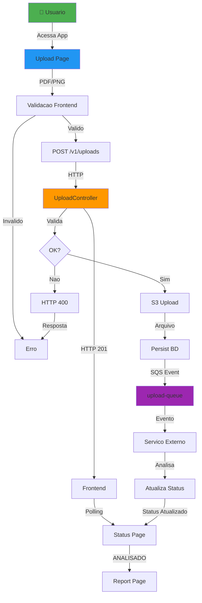
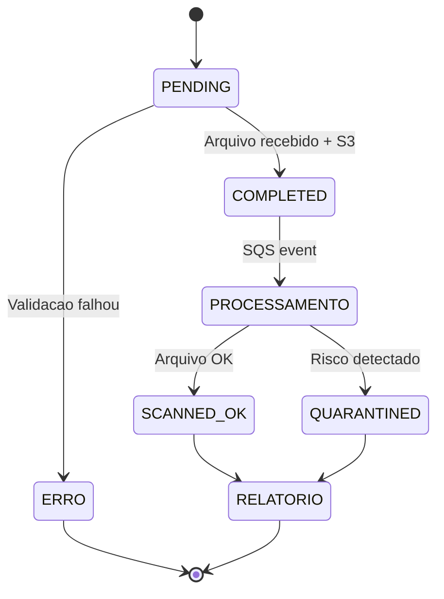

# Hackathon Services - Sistema de Upload Seguro com Análise de Diagramas

## 📋 Descrição do Problema

O projeto **Hackathon Services** aborda o desafio de **receber, armazenar e processar diagramas (arquivos PDF e imagens) de forma segura e escalável**, com análise automática de componentes, riscos de segurança e recomendações arquiteturais.

### Desafios Principais

1. **Recepção e validação de arquivos**: Garantir que apenas arquivos válidos (PDF, PNG, JPG) e com tamanho apropriado sejam aceitos
2. **Armazenamento distribuído**: Persistir arquivos em S3 AWS com chaves determinísticas e metadados consistentes
3. **Processamento assíncrono**: Publicar eventos para consumo por serviço externo sem bloquear a requisição
4. **Rastreamento de status**: Permitir que clientes acompanhem o progresso da análise em tempo real
5. **Geração de relatórios**: Consolidar análises (componentes, segurança, arquitetura, performance) de forma compreensível

### Premissas Arquiteturais

- **upload-service** é responsável por: receber arquivo, validar, persistir em S3, armazenar metadados, publicar evento
- **Serviço externo** é responsável por: consumir evento da fila, analisar arquivo, atualizar status
- **Frontend** é responsável por: interface de usuário, seleção de arquivo, polling de status, exibição de relatório

---

## 🏗️ Arquitetura Proposta

### Stack Tecnológico

#### Backend (upload-service)

- **Framework**: Spring Boot 4.0.4 (Java 21)
- **Persistência**: PostgreSQL (produção), H2 (teste)
- **Cloud Storage**: AWS S3 (armazenamento de arquivos)
- **Message Queue**: AWS SQS (publicação de eventos)
- **Build**: Maven
- **Testes**: JUnit 5, Mockito, LocalStack (infraestrutura local)

#### Frontend (secure-systems-frontend)

- **Framework**: React 19 + Vite
- **Roteamento**: React Router DOM
- **State Management**: React Context API + localStorage
- **Styling**: Tailwind CSS
- **Build**: Vite

#### Infraestrutura

- **Container**: Docker + Docker Compose (desenvolvimento)
- **Cloud**: AWS (ECS para deploy) + Docker Hub (registry de imagens)
- **LocalStack**: Emulação local de S3/SQS (testes)

### Arquitetura de Componentes

```
┌─────────────────────────────────────────────────────────────┐
│                   Frontend (React/Vite)                      │
├─────────────────────────────────────────────────────────────┤
│  Pages: Upload, Processing List, Status, Report             │
│  Components: FileUploader, Layout                           │
│  Context: ProcessingContext (estado + polling)             │
│  Services: apiService (real), mockApiService (testes)      │
└────────────────────┬────────────────────────────────────────┘
                     │ HTTP REST
                     ▼
┌─────────────────────────────────────────────────────────────┐
│            Backend (Spring Boot - upload-service)           │
├─────────────────────────────────────────────────────────────┤
│  Controllers:                                                │
│    ├─ ProjectController (POST /v1/projects)                 │
│    └─ UploadController (POST /v1/uploads, GET /{id})       │
│                                                              │
│  Use Cases:                                                  │
│    ├─ SingleUploadUseCase (orquestra upload → S3 → SQS)    │
│    └─ ProjectUseCase (criar projeto)                       │
│                                                              │
│  Wrappers (Integração Externa):                            │
│    ├─ S3ClientWrapper (upload arquivo)                     │
│    └─ SqsClientWrapper (publicar evento)                   │
│                                                              │
│  Persistence:                                               │
│    ├─ UploadRepository                                      │
│    ├─ ProjectRepository                                     │
│    └─ Upload, Project (JPA Entities)                       │
│                                                              │
│  Exception Handling:                                        │
│    └─ ApiExceptionHandler (respostas padronizadas)         │
└────────┬─────────────────┬─────────────────┬───────────────┘
         │                 │                 │
         ▼                 ▼                 ▼
    ┌─────────┐      ┌──────────┐      ┌──────────┐
    │ S3 AWS  │      │PostgreSQL│      │SQS Queue │
    │(arquivos)│    │(metadados)│     │(eventos) │
    └─────────┘      └──────────┘      └──────┬───┘
                                               │
                                               ▼
                                    ┌──────────────────┐
                                    │ Serviço Externo  │
                                    │(Análise/Proc.)   │
                                    └──────────────────┘
```

### Padrões Arquiteturais

- **Vertical Slice**: Cada feature (upload multipart) encapsula controller → usecase → repository
- **Dependency Injection**: Spring IOC para S3ClientWrapper, SqsClientWrapper, repositories
- **Exception Standardization**: Todas as exceções mapeadas para ApiErrorResponse
- **Async Communication**: Publicação de eventos via SQS desacoplada do ciclo de requisição HTTP

---

## 🔄 Fluxo da Solução

### 1. Jornada End-to-End: Do Upload ao Relatório

```
┌─────────────────────────────────────────────────────────────┐
│                    USUÁRIO FINAL                            │
└─────────────────────────────────────────────────────────────┘
                          │
                          ▼
            ┌──────────────────────────┐
            │  1. Upload Page (React)  │
            │  - Seleciona arquivo PDF │
            │  - Validação frontend    │
            │    (tamanho ≤ 8MB)      │
            └──────────┬───────────────┘
                       │
                       ▼
            ┌──────────────────────────┐
            │  2. POST /v1/uploads     │
            │  Multipart Form Data     │
            │  {file, metadata}        │
            └──────────┬───────────────┘
                       │
         ┌─────────────▼──────────────┐
         │   Backend Validação        │
         │  - Tamanho (≤ 8MB)        │
         │  - Content-Type suportado │
         │  - Extensão vs Type       │
         └──────┬──────────┬──────────┘
                │          │
                ▼          ▼
        ✅ Válido   ❌ Inválido
         │            │
         │            ▼
         │    HTTP 400 + Erro JSON
         │            │
         │             └──►(Feedback ao usuário)
         │
         ▼
   ┌──────────────────────┐
   │ 3. S3 Upload         │
   │ Gera S3 Key UUID     │
   │ Envia arquivo        │
   └──────────┬───────────┘
              │
              ▼
   ┌──────────────────────┐
   │ 4. Persiste Upload   │
   │ BD: status=COMPLETED │
   │ Retorna uploadId     │
   └──────────┬───────────┘
              │
              ▼
   ┌──────────────────────┐
   │ 5. Publica SQS Event │
   │ JSON: {eventId,      │
   │   s3Key, content...} │
   │ (se URL configurada) │
   └──────────┬───────────┘
              │
              ▼
   HTTP 201 Created + Location
         (uploadId, s3Key)
              │
              └──► Frontend redireciona
                   para /status/{uploadId}
                        │
                        ▼
            ┌──────────────────────────┐
            │  6. Status Page (React)  │
            │  Polling GET cada 5s     │
            │  Mostra 4 etapas:        │
            │  - Recebimento           │
            │  - Análise Componentes   │
            │  - Análise Segurança     │
            │  - Geração Relatório     │
            └──────────┬───────────────┘
                       │
        ┌──(Serviço Externo processa)──┐
        │                               │
        ▼                               ▼
         SCANNED_OK         QUARANTINED / ANALYSIS_INVALID /
         (Arquivo OK)       ANALYSIS_REVIEW_REQUIRED
                (riscos, inconsistência, revisão manual)
        │                               │
        └───────────┬────────────────────┘
                    │
                    ▼
        ┌────────────────────────┐
        │  7. Report Page        │
        │  (quando ANALISADO)    │
        │  - Componentes         │
        │  - Segurança           │
        │  - Arquitetura         │
        │  - Performance         │
        │  - Recomendações       │
        └────────────────────────┘
```

### 2. Estados do Upload

```
[PENDING] → (arquivo subido)
    │
    ▼
[COMPLETED] → (persistido em BD + S3)
    │
    ├─► [PUBLICADO] → (SQS event enviado)
    │         │
    │         └─► [PROCESSAMENTO_EXTERNO]
    │                  │
    │                  ├─► [SCANNED_OK] → Frontend exibe relatório
    │                  │
  │                  ├─► [QUARANTINED] → Frontend exibe bloqueio
  │                  │
  │                  ├─► [ANALYSIS_INVALID] → Frontend exibe erro de análise
  │                  │
  │                  └─► [ANALYSIS_REVIEW_REQUIRED] → Frontend exibe revisão pendente
    │
    └─► [NÃO_PUBLICADO] (se queue URL vazia)


Responsabilidades:
├─ upload-service: PENDING → COMPLETED
└─ serviço externo: COMPLETED → SCANNED_OK / QUARANTINED / ANALYSIS_INVALID / ANALYSIS_REVIEW_REQUIRED
```

### 3. Contrato de API - Principais Endpoints

#### Criar Projeto

```http
POST /v1/projects HTTP/1.1
Content-Type: application/json

{
  "name": "Projeto A",
  "description": "Análise de arquitetura",
  "ownerId": "user-123"
}

← HTTP 200
{
  "id": "proj-uuid",
  "name": "Projeto A",
  "description": "Análise de arquitetura"
}
```

#### Upload de Arquivo (Multipart)

```http
POST /v1/uploads HTTP/1.1
Content-Type: multipart/form-data; boundary=----

------
Content-Disposition: form-data; name="file"; filename="diagram.pdf"
Content-Type: application/pdf

[binary PDF content]
------
Content-Disposition: form-data; name="metadata"
Content-Type: application/json

{
  "filename": "diagram.pdf",
  "projectId": "proj-uuid",
  "uploaderId": "user-123"
}
------

← HTTP 201 Created
Location: /v1/uploads/upload-uuid
{
  "uploadId": "upload-uuid",
  "s3Key": "projects/proj-uuid/user-123/upload-uuid.pdf",
  "status": "COMPLETED"
}
```

#### Consultar Status

```http
GET /v1/uploads/{uploadId} HTTP/1.1

← HTTP 200
{
  "uploadId": "upload-uuid",
  "s3Key": "projects/...",
  "status": "COMPLETED",
  "createdAt": "2026-04-09T10:30:00Z"
}

ou

← HTTP 404
{
  "message": "Upload não encontrado",
  "code": "UPLOAD_NOT_FOUND",
  "detail": "uploadId: invalid-uuid"
}
```

### 4. Fluxo de Validação

| Validação                    | Local                             | Resposta em Erro                      |
| ---------------------------- | --------------------------------- | ------------------------------------- |
| **Tamanho arquivo**          | Frontend + Backend (≤ 8MB, limite Sonar S5693) | `400 FILE_SIZE_EXCEEDED`              |
| **Content-Type**             | Backend                           | `400 INVALID_CONTENT_TYPE`            |
| **Extensão vs Content-Type** | Backend                           | `400 BAD_REQUEST` (incompatibilidade) |
| **Metadata JSON**            | Backend                           | `400 INVALID_MULTIPART_METADATA`      |
| **Arquivo não existe**       | GET /uploads/{id}                 | `404 UPLOAD_NOT_FOUND`                |

---

## 🚀 Instruções de Execução

## 🔁 Pipeline CI/CD

- **Build**: executa `mvn -B -ntp verify` em toda `pull_request` e `push`.
- **Teste de imagem**: executa `docker build` para validar a imagem publicada pela pipeline.
- **Deploy**: em `push`, resolve o ambiente a partir do nome da branch, publica a imagem no Docker Hub e atualiza o serviço ECS correspondente.

### Convenções da pipeline

- **Região AWS padrão**: `us-east-2`.
- **Ambiente**: derivado da branch atual, convertido para minúsculas e com caracteres inválidos substituídos por `-`.
- **Cluster ECS**: `${ECS_CLUSTER_PREFIX}-${branch}`.
- **Service ECS**: `${ECS_SERVICE_PREFIX}-${branch}`.
- **Spring profile**: recebe o mesmo nome do ambiente derivado da branch.
- **Imagem Docker**: `docker.io/<DOCKERHUB_USERNAME>/<DOCKERHUB_IMAGE_NAME>:<github.sha>`.

### Secrets e variables esperados no GitHub

- **Secrets**: `AWS_ROLE_TO_ASSUME`, `DOCKERHUB_USERNAME`, `DOCKERHUB_TOKEN`.
- **Variables opcionais**: `AWS_REGION`, `DOCKERHUB_IMAGE_NAME`, `ECS_CLUSTER_PREFIX`, `ECS_SERVICE_PREFIX`, `ECS_CONTAINER_NAME`.

### Pré-requisitos

- **Java 21+** (`java -version`)
- **Maven 3.8+** (`mvn -version`)
- **Node.js 18+** + npm (`node -v`, `npm -v`)
- **Docker + Docker Compose** (para infraestrutura local)
- **AWS credentials** (para integração com S3/SQS em produção)

### 1. Clonar o Repositório

```bash
git clone <repo-url>
cd hackathon-services
```

### 2. Backend - upload-service

#### 2.1 Instalar Dependências

```bash
cd upload-service
mvn clean install
```

#### 2.2 Configurar Ambiente (desenvolvimento local)

> **S3 `405 Method Not Allowed`:** se `CLOUD_AWS_ENDPOINT_S3` (ou o default em `application-dev.properties`) apontar para a **URL do Console AWS** (`console.aws.amazon.com/.../buckets/...`), o SDK tenta `PutObject` em uma página HTML e recebe 405. Use endpoint **vazio** para AWS real (`s3.<região>.amazonaws.com` implícito) ou **`http://localhost:4566`** para LocalStack.

Editar `upload-service/src/main/resources/application-dev.properties`:

```properties
# S3 Configuration
application.s3.bucket=my-local-bucket
application.s3.region=us-east-1

# SQS Configuration (opcional)
application.sqs.queueUrl=http://localhost:4566/000000000000/upload-queue

# Database (H2 em testes, PostgreSQL em prod)
spring.datasource.url=jdbc:h2:mem:testdb
spring.datasource.driver-class-name=org.h2.Driver

# AWS Endpoint (LocalStack)
application.aws.endpoint=http://localhost:4566
```

#### 2.3 Iniciar Infraestrutura Local (S3 + SQS)

```bash
docker-compose up -d
# Aguardar logs: "Ready to accept connections"
```

#### 2.4 Executar Testes

```bash
mvn test
# Esperado: EXIT_CODE:0 com 5+ testes passando
```

#### 2.5 Iniciar Backend

```bash
mvn spring-boot:run -Dspring-boot.run.arguments="--spring.profiles.active=dev"
# Acesso: http://localhost:8080

# Verificar health
curl http://localhost:8080/actuator/health
```

### 3. Frontend - secure-systems-frontend

#### 3.1 Instalar Dependências

```bash
cd secure-systems-frontend
npm install
```

#### 3.2 Configurar Baseado em Ambiente

Editar `src/services/apiService.js`:

```javascript
const API_BASE_URL = process.env.REACT_APP_API_URL || "http://localhost:8080";
// Para desenvolvimento local: http://localhost:8080
```

#### 3.3 Executar em Modo Desenvolvimento

```bash
npm run dev
# Acesso: http://localhost:5173
```

Arquivo observado para hot reload:

- `src/**/*.jsx` - Componentes

#### 3.4 Build para Produção

```bash
npm run build
# Output: dist/
# Deploy: Servir dist/ com nginx/apache
```

### 4. Testar a Jornada Completa

#### 4.1 Criar Projeto

```bash
curl -X POST http://localhost:8080/v1/projects \
  -H "Content-Type: application/json" \
  -d '{
    "name": "Teste Hackathon",
    "description": "Upload de diagrama teste",
    "ownerId": "user-demo"
  }'

# Resposta: { "id": "abc123", "name": "Teste Hackathon", ... }
```

#### 4.2 Fazer Upload de Arquivo

```bash
curl -X POST http://localhost:8080/v1/uploads \
  -F "file=@diagram.pdf;type=application/pdf" \
  -F 'metadata={"projectId":"abc123","uploaderId":"user-demo","filename":"diagram.pdf"}' \
  -v

# Esperado: HTTP 201 Created
# Location header: /v1/uploads/upload-uuid
# Body: { "uploadId": "...", "s3Key": "...", "status": "COMPLETED" }
```

#### 4.3 Consultar Status

```bash
curl http://localhost:8080/v1/uploads/upload-uuid

# Resposta: { "uploadId": "...", "status": "COMPLETED", ... }
```

#### 4.4 Acessar Frontend

Abrir `http://localhost:5173` no navegador:

1. Clicar em "Upload"
2. Selecionar arquivo PDF/PNG
3. Clicar em "Enviar"
4. Ser redirecionado para página de status
5. Ver barra de progresso e etapas

### 5. Docker - Executar Tudo Junto (Opcional)

```bash
# Parar serviços anteriores
docker-compose down

# Iniciar tudo (backend + infraestrutura)
docker-compose up -d

# Logs em tempo real
docker-compose logs -f

# Limpar
docker-compose down -v
```

### 6. Verificações de Saúde

```bash
# Backend ativo
curl http://localhost:8080/actuator/health
# Esperado: { "status": "UP" }

# S3 LocalStack ativo
curl http://localhost:4566
# Esperado: 200 OK

# SQS LocalStack ativo
curl -X POST http://localhost:4566 \
  -H "X-Amz-Target: DynamoDB_20120810.ListTables"
# Esperado: {"TableNames":[]} ou lista de filas
```

---

## 📊 Diagramas

### Fluxo Geral da Solução



### Ciclo de Vida do Upload



---

## 🧪 Testes

### Backend - Testes de Integração

```bash
cd upload-service
mvn test

# Resultados esperados:
# - UploadIntegrationTest.java: 5+ cenários
#   ✅ PDF upload válido
#   ✅ PNG upload válido
#   ✅ Validacao de content-type
#   ✅ Extensao vs content-type
#   ✅ Arquivo não encontrado (404)
```

### Frontend - Testes Manuais (ou com Cypress/Vitest)

1. **Upload Page**: Selecionar arquivo → Validar feedback
2. **Status Page**: Verificar polling a cada 5s
3. **List Page**: Filtrar e ordenar uploads
4. **Report Page**: Exibir relatório para upload ANALISADO

---

## 📚 Referências

- **BDD-FLOW.md**: Especificação completa em formato Gherkin
- **Postman Collection**: `upload-service/docs/postman/upload-service.postman_collection.json`
- **Sequência DiagramaA**: `BDD-FLOW.md` - Seção "Sequencia de Integracao"

---

## 🔧 Troubleshooting

### Erro: "S3 connection refused"

```bash
# Verificar se Docker está rodando
docker ps | grep localstack

# Reiniciar
docker-compose restart localstack
```

### Erro: "Queue URL not found"

```bash
# Certificar que SQS queue existe
aws --endpoint-url=http://localhost:4566 sqs list-queues

# Recriar se necessário
aws --endpoint-url=http://localhost:4566 sqs create-queue --queue-name upload-queue
```

### Frontend não conecta ao backend

```bash
# Verificar CORS no backend (application-dev.properties)
# Verificar host/porta no apiService.js
# Confirmar que backend está em http://localhost:8080
```

### Testes falham no PostgreSQL

```bash
# Usar H2 em memory para testes locais
# Editar: src/test/resources/application.properties
spring.datasource.url=jdbc:h2:mem:testdb
```

---

## 📝 Próximos Passos

1. **Implementar autenticação**: JWT/OAuth2 para proteger endpoints
2. **Adicionar CI/CD**: GitHub Actions ou GitLab CI
3. **Monitoramento**: Prometheus + Grafana
4. **Rate Limiting**: Para proteger endpoints de carga
5. **Integração com análise real**: Substituir MockApiService por motor real de análise
6. **Caching**: Redis para melhorar performance de polling
7. **Testes E2E**: Cypress ou Playwright

---

## 📄 Licença

Propriedade da FIAP - Hackathon Services 2026

## 👥 Contato

Para dúvidas ou contribuições, abrir issue no repositório do projeto.

---

**Versão**: 1.0  
**Data**: Abril 2026  
**Status**: ✅ Production Ready (com melhorias recomendadas)
