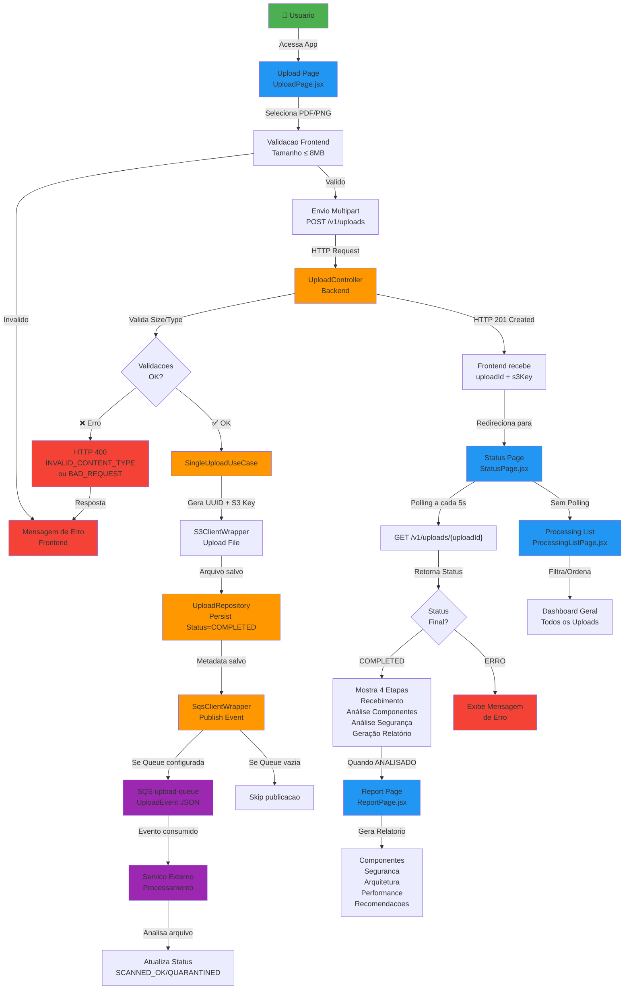
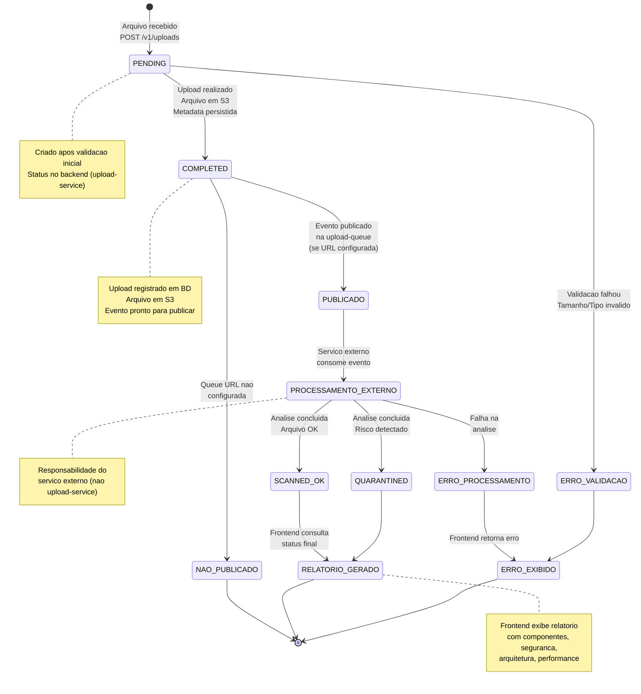
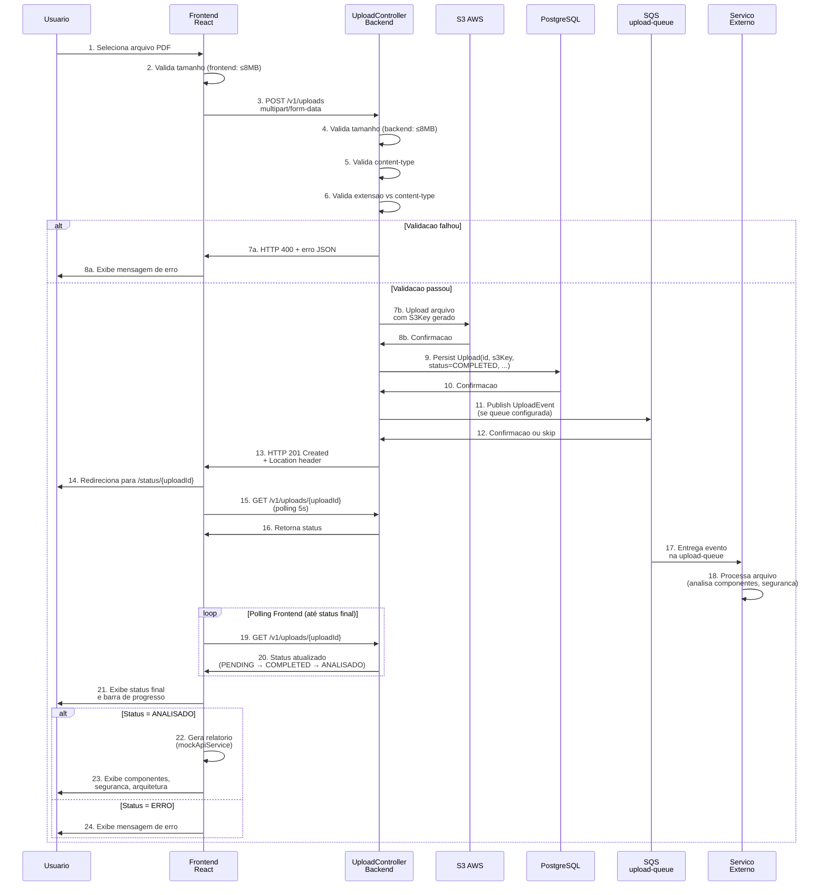

# BDD Flow - Hackathon Services

Este documento descreve o fluxo BDD do projeto como um todo (frontend + upload-service), com foco em comportamento observavel.

## Escopo analisado

- Frontend React/Vite: upload, lista, status, relatorio
- Backend Spring Boot: criacao de projeto, upload multipart, consulta de status
- Infra: S3 para armazenamento e SQS upload-queue para consumo por servico externo

## Premissas

- O backend e responsavel por receber arquivo, persistir metadados e publicar evento na upload-queue.
- O consumo da fila e responsabilidade de um servico externo.
- O frontend representa status de negocio para o usuario final.

---

## Feature 1 - Criacao de Projeto

```gherkin
Feature: Criar projeto para agrupar uploads
  As a cliente do sistema
  I want criar um projeto
  So that uploads possam ser associados a um contexto de negocio

  Scenario: Criar projeto com dados validos
    Given que o cliente possui nome, descricao e ownerId validos
    When ele envia POST /v1/projects com JSON valido
    Then a API responde 200
    And retorna um id de projeto no corpo
    And persiste o projeto no banco
```

---

## Feature 2 - Upload Unificado (multipart)

```gherkin
Feature: Enviar diagrama com metadados em uma unica requisicao
  As a cliente do sistema
  I want enviar arquivo e metadata em multipart/form-data
  So that o backend conclua o upload e publique evento de processamento

  Background:
    Given que existe um projeto valido
    And existe bucket S3 configurado
    And existe queue SQS configurada

  Scenario: Upload PDF valido
    Given um arquivo "diagram.pdf" com content-type "application/pdf"
    And metadata JSON com filename, projectId e uploaderId
    When o cliente envia POST /v1/uploads em multipart/form-data
    Then a API responde 201
    And retorna uploadId e s3Key
    And retorna header Location com /v1/uploads/{uploadId}
    And o arquivo fica disponivel no S3
    And o status do upload fica COMPLETED
    And um evento e publicado na upload-queue

  Scenario: Upload PNG valido
    Given um arquivo "imagem.png" com content-type "image/png"
    And metadata JSON valida
    When o cliente envia POST /v1/uploads
    Then a API responde 201
    And retorna s3Key com extensao .png
```

---

## Feature 3 - Regras de Validacao de Upload

```gherkin
Feature: Rejeitar uploads invalidos
  As a backend de upload
  I want validar tamanho, tipo e consistencia de metadados
  So that apenas arquivos suportados sejam processados

  Scenario: Metadata enviada com content-type incorreto
    Given um multipart com parte "metadata" em text/plain
    When o cliente envia POST /v1/uploads
    Then a API responde 400
    And retorna code INVALID_MULTIPART_METADATA ou erro de payload invalido

  Scenario: Content-type nao suportado
    Given um arquivo com content-type "text/plain"
    When o cliente envia POST /v1/uploads
    Then a API responde 400
    And retorna code INVALID_CONTENT_TYPE

  Scenario: Extensao nao compativel com content-type
    Given um arquivo chamado "imagem.pdf" com content-type "image/png"
    When o cliente envia POST /v1/uploads
    Then a API responde 400
    And retorna code BAD_REQUEST
    And o detalhe informa incompatibilidade de extensao

  Scenario: Arquivo acima de 8MB
    Given um arquivo maior que 8MB
    When o cliente envia POST /v1/uploads
    Then a API responde 400
    And retorna code FILE_SIZE_EXCEEDED
```

---

## Feature 4 - Consulta de Status no Backend

```gherkin
Feature: Consultar status de upload por id
  As a cliente do sistema
  I want consultar o upload por id
  So that eu acompanhe o processamento

  Scenario: Consultar upload existente
    Given que existe um upload persistido
    When o cliente envia GET /v1/uploads/{uploadId}
    Then a API responde 200
    And retorna status do upload

  Scenario: Consultar upload inexistente
    Given um uploadId que nao existe
    When o cliente envia GET /v1/uploads/{uploadId}
    Then a API responde 404
    And retorna code UPLOAD_NOT_FOUND
```

---

## Feature 5 - Publicacao na Fila para Consumo Externo

```gherkin
Feature: Publicar evento para processamento externo
  As a upload-service
  I want publicar evento na upload-queue
  So that um servico externo faca o consumo

  Scenario: Publicar evento apos upload concluido
    Given upload salvo com status COMPLETED
    When o backend finaliza o fluxo de upload
    Then um evento JSON e enviado para application.sqs.queueUrl
    And o payload contem eventId, s3Key, contentType, sizeBytes, uploaderId e projectId

  Scenario: Queue URL nao configurada
    Given application.sqs.queueUrl vazio
    When o backend finaliza o upload
    Then o upload permanece COMPLETED
    And nenhuma tentativa de publicacao e feita
```

---

## Feature 6 - Jornada Frontend: Upload ate Status

```gherkin
Feature: Jornada do usuario no frontend
  As a usuario da interface
  I want enviar arquivo e acompanhar status
  So that eu saiba quando o resultado estiver pronto

  Scenario: Usuario seleciona arquivo valido
    Given que o usuario esta na tela de upload
    When seleciona um arquivo PDF valido
    Then o frontend habilita a acao de envio

  Scenario: Usuario ve erro de envio
    Given que ocorre falha na API durante upload
    When o usuario tenta enviar arquivo
    Then o frontend exibe mensagem de erro amigavel

  Scenario: Usuario acompanha status
    Given que existe um upload cadastrado no contexto
    When o usuario abre /status/{uploadId}
    Then ele visualiza o status atual e barra de progresso
```

---

## Feature 7 - Lista de Processamento no Frontend

```gherkin
Feature: Listar e filtrar uploads no frontend
  As a usuario da interface
  I want filtrar uploads por status
  So that eu possa priorizar analise e acompanhamento

  Scenario: Filtrar por status
    Given que existem uploads com diferentes status
    When o usuario seleciona um filtro de status
    Then a lista exibe apenas uploads daquele status

  Scenario: Ordenar uploads
    Given que existem multiplos uploads
    When o usuario escolhe ordenacao por data, nome ou status
    Then a lista respeita a ordenacao escolhida
```

---

## Feature 8 - Relatorio Tecnico no Frontend

```gherkin
Feature: Visualizar relatorio tecnico
  As a usuario
  I want abrir o relatorio de um upload analisado
  So that eu possa consultar riscos e recomendacoes

  Scenario: Relatorio disponivel para upload analisado
    Given que o upload esta com status Analisado
    When o usuario abre /reports/{uploadId}
    Then o frontend gera/exibe relatorio tecnico
    And mostra componentes, seguranca, arquitetura, performance e recomendacoes

  Scenario: Relatorio indisponivel para upload nao analisado
    Given que o upload nao esta Analisado
    When o usuario abre /reports/{uploadId}
    Then o frontend exibe estado de erro amigavel
```

---

## Feature 9 - Contrato de Integracao Frontend x Backend

```gherkin
Feature: Contrato entre frontend e backend
  As a time de engenharia
  I want manter contratos de API consistentes
  So that a jornada end-to-end funcione sem ajustes manuais

  Scenario: Frontend envia payload no formato esperado pelo backend
    Given que o backend espera multipart em POST /v1/uploads
    When o frontend envia upload
    Then o formato da requisicao deve ser multipart/form-data com file + metadata JSON

  Scenario: Frontend consulta endpoint existente
    Given que o backend expoe apenas GET /v1/uploads/{uploadId} para consulta
    When o frontend faz polling de status
    Then deve usar endpoint existente
    And nao deve depender de endpoints nao publicados
```

---

## Criterios de aceite transversais

- Erros padronizados em JSON com campos message, code, detail.
- Upload valido deve gerar uploadId, s3Key e status COMPLETED.
- Arquivo deve existir no S3 apos upload 201.
- Evento deve ser publicado na upload-queue quando configurada.
- Consumo da fila nao faz parte do upload-service.

## Sugestao de uso

- Executar estes cenarios em 3 niveis:
  - API/integracao (backend)
  - UI (frontend)
  - Contrato (frontend x backend)
- Mapear cada cenario para testes automatizados existentes e faltantes.

---

## Diagrama de Fluxo - Visao Geral do Sistema



---

## Diagrama de Estados - Ciclo de Vida do Upload



---

## Sequencia de Integracao - Frontend x Backend


