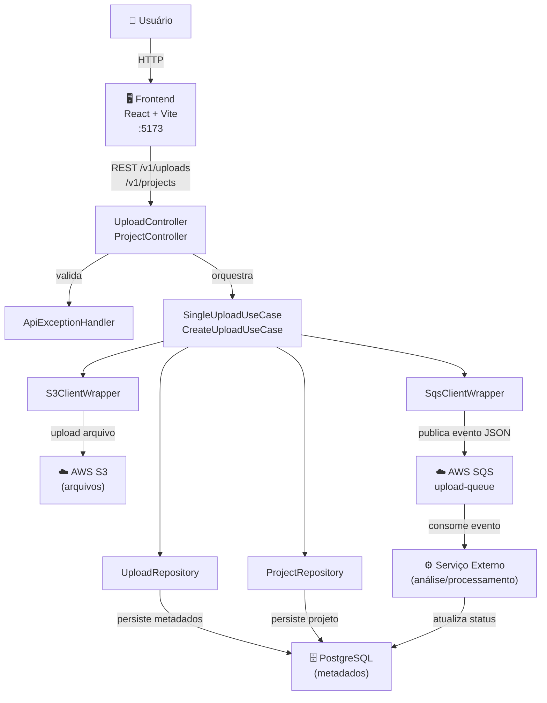
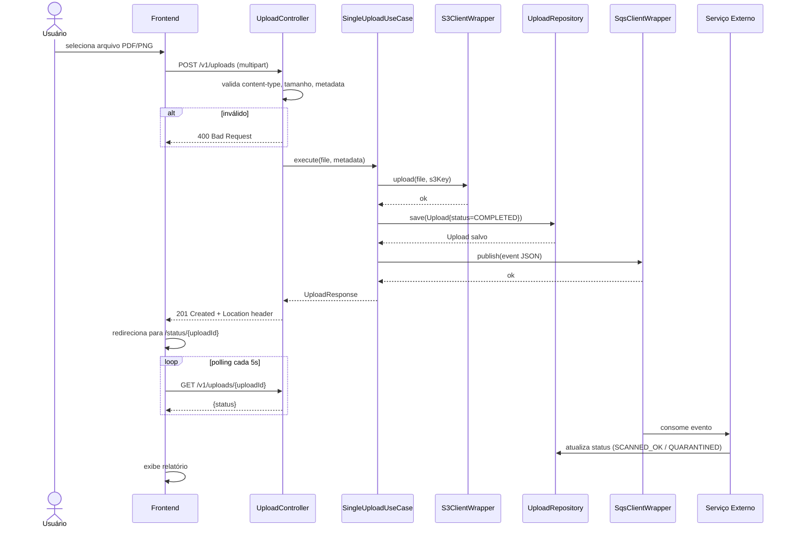
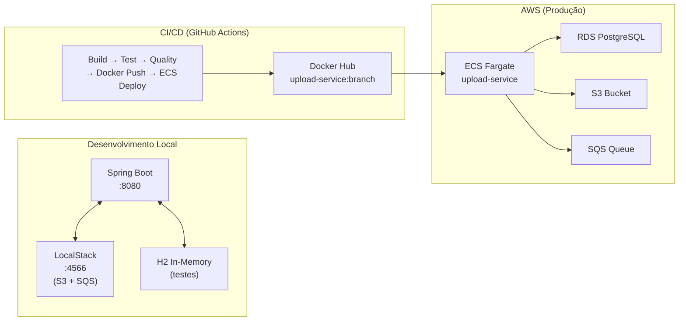
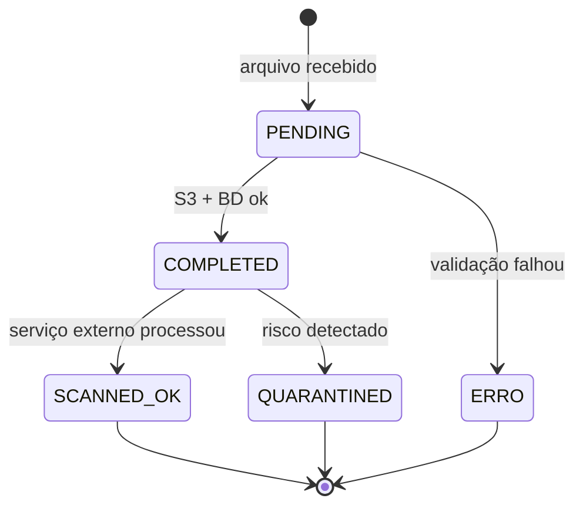

# Diagrama de Arquitetura - Upload Service

## Visão Geral



---

## Camadas da Aplicação

```
upload-service/
├── adapter/
│   ├── controller/         # Entrada HTTP (REST)
│   │   ├── UploadController       POST /v1/uploads, GET /v1/uploads/{id}
│   │   ├── ProjectController      POST /v1/projects
│   │   └── ApiExceptionHandler    Tratamento centralizado de erros
│   ├── dto/                # Request/Response objects
│   └── persistence/        # Interfaces JPA
│       ├── UploadRepository
│       └── ProjectRepository
│
├── domain/                 # Entidades de negócio
│   ├── Upload.java
│   ├── Project.java
│   └── UploadStatus.java   (RECEBIDO, EM_PROCESSAMENTO, ANALISADO, ERRO)
│
├── usecase/                # Casos de uso (regras de negócio)
│   ├── SingleUploadUseCase   valida → S3 → persiste → SQS
│   └── CreateUploadUseCase
│
└── infra/
    └── aws/                # Integrações externas
        ├── S3ClientWrapper
        └── SqsClientWrapper
```

---

## Diagrama de Sequência - Upload de Arquivo



---

## Infraestrutura



---

## Estados do Upload


