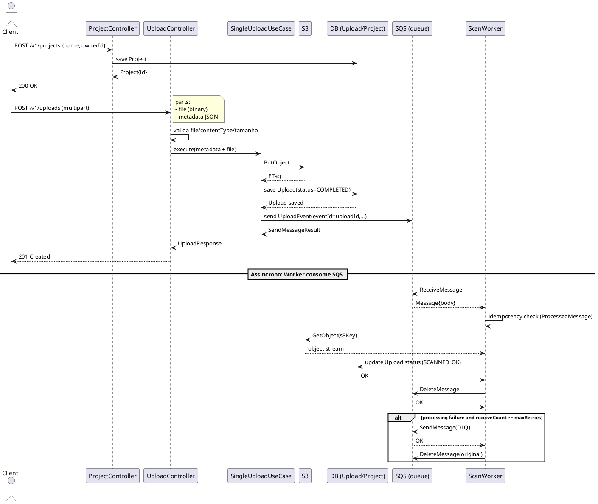

# Fluxo de Cadastro e Processamento de Uploads

Este documento descreve o fluxo atual de cadastro de `Project` e de upload/processamento de arquivos no formato unificado.

## Endpoints principais

- `POST /v1/projects` - cria um `Project`.
- `POST /v1/uploads` - endpoint unico de upload (multipart) com arquivo + metadados.
- `GET /v1/uploads/{uploadId}` - consulta status do upload.

## Contrato do endpoint de upload

`POST /v1/uploads`

`Content-Type: multipart/form-data`

Partes obrigatorias:

- `file` (binario)
- `metadata` (JSON)

Exemplo de `metadata`:

```json
{
  "filename": "resultado.pdf",
  "contentType": "application/pdf",
  "projectId": "11111111-1111-1111-1111-111111111111",
  "uploaderId": "user-123"
}
```

Resposta de sucesso (`201 Created`):

```json
{
  "uploadId": "a9a92228-5463-4722-aa39-cb495a52c030",
  "presignedUrl": null,
  "s3Key": "uploads/dev/11111111-1111-1111-1111-111111111111/2026-04-03/user-123/a9a92228-5463-4722-aa39-cb495a52c030.pdf",
  "expiresInSeconds": 0
}
```

## Regras de validacao

- Tipos aceitos: `application/pdf`, `image/png`, `image/jpg`, `image/jpeg`
- O `contentType` do `metadata` deve ser igual ao `contentType` do arquivo enviado
- Tamanho maximo do arquivo: `1GB`

Configuracao relevante:

- `spring.servlet.multipart.max-file-size=1GB`
- `spring.servlet.multipart.max-request-size=1GB`

## Respostas de erro padronizadas

Todos os erros de validacao/not found seguem o formato:

```json
{
  "message": "...",
  "code": "...",
  "detail": "..."
}
```

Exemplos:

Content-Type invalido (`400`):

```json
{
  "message": "Invalid upload request",
  "code": "INVALID_CONTENT_TYPE",
  "detail": "Only PDF, PNG, JPG or JPEG files are allowed"
}
```

Arquivo acima de 1GB (`400`):

```json
{
  "message": "Invalid upload request",
  "code": "FILE_SIZE_EXCEEDED",
  "detail": "File size exceeds maximum allowed size of 1GB"
}
```

Upload nao encontrado (`404`):

```json
{
  "message": "Resource not found",
  "code": "UPLOAD_NOT_FOUND",
  "detail": "Upload not found for id <uuid>"
}
```

## Resumo do fluxo

1. Cliente cria um projeto com `POST /v1/projects`.
2. Cliente envia arquivo e metadados no `POST /v1/uploads` (multipart).
3. `UploadController` valida arquivo, tipo e tamanho.
4. `SingleUploadUseCase` gera `uploadId` e `s3Key`, envia o arquivo ao S3, salva `Upload` com status `COMPLETED` e publica evento no SQS.
5. `ScanWorker` consome evento, verifica idempotencia e valida disponibilidade do arquivo no S3.
6. Em sucesso, status do upload passa para `SCANNED_OK`.
7. Em falhas repetidas, a mensagem e enviada para a DLQ conforme `maxRetries`.

## Diagrama de Sequencia (PlantUML)



## Referencias

- Swagger UI: `/swagger-ui.html`
- OpenAPI JSON: `/v3/api-docs`
- Collection Postman local: `docs/postman/upload-service.postman_collection.json`
