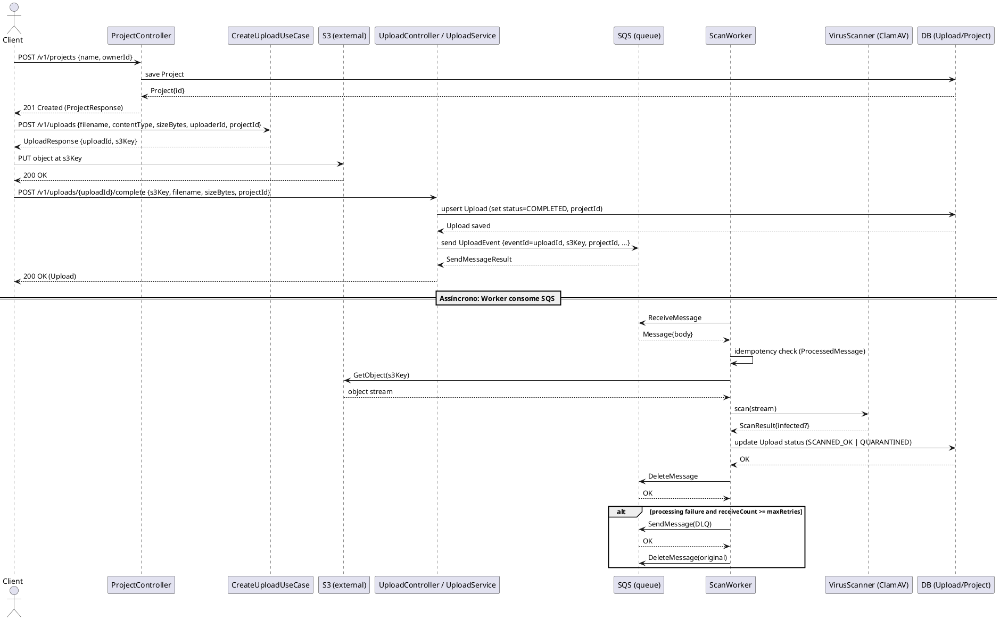

# Fluxo de Cadastro e Processamento de Uploads

Este documento descreve o fluxo de cadastro de um `Project` e o fluxo de upload/análise de arquivos (PDF/imagem) implementado no serviço.

## Endpoints principais

- `POST /v1/projects` — cria um `Project` (controlador: `ProjectController`).
- `POST /v1/uploads` — inicia um upload gerando `uploadId` e `s3Key` (use-case: `CreateUploadUseCase`).
- `POST /v1/uploads/{uploadId}/complete` — marca upload como completo; salva metadados em `Upload` e publica evento em SQS (service: `UploadService`).

## Resumo do fluxo

1. Cliente cria um projeto com `POST /v1/projects`.
2. Cliente solicita a criação de um upload com `POST /v1/uploads`, enviando `projectId` e metadados.
3. `CreateUploadUseCase` gera `uploadId` e `s3Key` (caminho onde o cliente deve enviar o arquivo para o S3).
4. Cliente envia o arquivo diretamente para S3 (fluxo externo ao serviço) usando o `s3Key` retornado.
5. Cliente chama `POST /v1/uploads/{uploadId}/complete` com `s3Key`, `filename`, `contentType`, `sizeBytes` e `projectId`.
6. `UploadService.completeUpload` grava/atualiza a entidade `Upload` (incluindo `projectId`) com status `COMPLETED` e publica um `UploadEvent` na fila SQS (campo `eventId` contém `uploadId`).
7. O `ScanWorker` (consumidor SQS) faz poll na fila, verifica idempotência, baixa o objeto do S3 e chama o `VirusScanner` (ClamAV) para análise.
8. Dependendo do resultado do scanner, o `Upload` é atualizado para `SCANNED_OK` ou `QUARANTINED`. A mensagem SQS é deletada e o processamento marcado.
9. Em caso de falhas repetidas, após `maxRetries` o `ScanWorker` encaminha a mensagem para a DLQ e marca como processada.

## Diagrama de Sequência (PlantUML)

## Observações técnicas

- O `uploadId` é usado como `eventId` na mensagem SQS para rastreabilidade e para que o `ScanWorker` possa atualizar o registro em `uploads`.
- O `projectId` é propagado e armazenado no `Upload`, permitindo associar múltiplos arquivos a um mesmo projeto.
- O serviço assume que o cliente fará o upload para o S3 usando o `s3Key` retornado; a geração de presigned URLs foi removida do fluxo atual.
- Idempotência do consumidor é feita via a tabela `processed_messages` (`ProcessedMessageRepository`).
- Em caso de erro permanente, mensagens são encaminhadas para a DLQ configurada (campo `application.sqs.dlqUrl`).

---

Arquivo gerado: `docs/sequence-upload.md`
